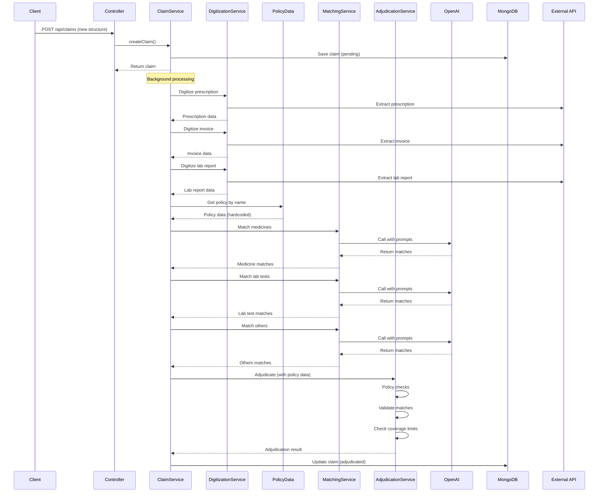

# OPD Claim Adjudication with Matching (Updated)

## Overview

Update the claim processing system to:

1. Accept the full input structure from README (lines 679-704)
2. Digitize prescription, invoice, and lab report documents (NOT policies)
3. Use hardcoded policy data for Niva Bupa and Aditya Birla Health Insurance
4. Implement OpenAI-based matching for medicines, lab tests, and others
5. Perform adjudication against stored policy data
6. Save comprehensive adjudication results

## Updated Input Structure

```json
{
  "patientDetails": { "name": "Bikash Ranjan" },
  "prescriptionsUrls": [{ "url": "..." }],
  "invoiceUrls": [{ "url": "..." }],
  "supportDocumentsUrl": [{ "url": "..." }], // lab reports
  "userRaisedAmount": "618.00",
  "requestDate": "15/12/2025",
  "policyDocuments": [{ "policyName": "Niva Bupa" }] // or "Aditya Birla Health Insurance"
}
```

## Policy Data Storage

**DO NOT digitize policies.** Store hardcoded policy data:

1. **Niva Bupa** - Store in `src/data/policies/nivaBupa.ts`
2. **Aditya Birla Health Insurance** - Store in `src/data/policies/adityaBirla.ts`

Use `policyName` from input to select the appropriate policy for adjudication.

## Implementation Changes

### 1. Update Claim Model ([src/models/Claim.ts](src/models/Claim.ts))

- Add fields: `patientDetails`, `prescriptionsUrls`, `invoiceUrls`, `supportDocumentsUrl`, `userRaisedAmount`, `requestDate`, `policyDocuments`
- Store digitized data: `prescriptionData`, `invoiceData`, `labReportData`
- Store policy data reference: `policyName` (used to select from hardcoded policies)
- Store matching results: `medicineMatches`, `labTestMatches`, `othersMatches`
- Store adjudication result with rejection reasons

### 2. Create Policy Data Files

- **Create**: `src/data/policies/nivaBupa.ts` - Hardcoded Niva Bupa policy data
- **Create**: `src/data/policies/adityaBirla.ts` - Hardcoded Aditya Birla policy data
- **Create**: `src/data/policies/index.ts` - Export policy getter function

### 3. Create Matching Service ([src/services/matchingService.ts](src/services/matchingService.ts))

- Use OpenAI prompts from `src copy/api/ai/prompts/matchingPrompts.ts`
- `matchMedicines()`: Match invoice medicines with prescription medicines
- `matchLabTests()`: Match invoice lab tests with prescription and lab report data
- `matchOthers()`: Match invoice other items with prescription
- Return structured matching results

### 4. Update Adjudication Service ([src/services/adjudicationService.ts](src/services/adjudicationService.ts))

- Accept digitized data (prescription, invoice, lab report)
- Get policy data from hardcoded storage based on `policyName`
- Perform policy checks:
  - Policy active (check dates)
  - Invoice date vs policy dates
  - Benefit coverage validation
  - Coverage limits validation
- Use matching service for medicines, lab tests, others
- Check exclusions from policy
- Calculate approval/rejection based on:
  - Policy validation results
  - Matching results (all items must match)
  - Coverage limits
  - Exclusions
- Return detailed adjudication result

### 5. Update Digitization Service ([src/services/digitizationService.ts](src/services/digitizationService.ts))

- `digitizePrescriptions()`: Extract prescription data
- `digitizeInvoices()`: Extract invoice data
- `digitizeLabReports()`: Extract lab report data
- **REMOVE**: Policy digitization (use hardcoded data instead)
- Use appropriate extraction fields from README.MD

### 6. Update Claim Service ([src/services/claimService.ts](src/services/claimService.ts))

- Update `createClaim()` to accept new input structure
- Background processing flow:

  1. Digitize documents (prescription, invoice, lab report) - **NOT policy**
  2. Get policy data from hardcoded storage
  3. Run matching (medicines, lab tests, others)
  4. Run adjudication with policy data
  5. Save results

### 7. Create Prompts Directory ([src/prompts/](src/prompts/))

- Copy/adapt prompts from `src copy/api/ai/prompts/matchingPrompts.ts`:
  - `medicineMatchingPrompts.ts`
  - `labTestMatchingPrompts.ts`
  - `othersMatchingPrompts.ts`

### 8. Update OpenAI Utils ([src/utils/openai.ts](src/utils/openai.ts))

- Add `chatCompletion()` function for OpenAI API calls
- Support system and user prompts
- Handle JSON parsing from responses

### 9. Update Controller ([src/controllers/claimController.ts](src/controllers/claimController.ts))

- Update `createClaim()` to validate new input structure
- Validate `policyName` is either "Niva Bupa" or "Aditya Birla Health Insurance"

## Data Flow



## Key Features

1. **Document Digitization**: Extract data from prescription, invoice, and lab report (NOT policy)
2. **Hardcoded Policy Data**: Use stored policy data for Niva Bupa and Aditya Birla
3. **AI-Powered Matching**: Use OpenAI to match medicines, lab tests, and others
4. **Policy-Based Adjudication**: 

   - Policy validation (dates, active status)
   - Benefit coverage validation
   - Coverage limits validation
   - Exclusions check
   - Match validation (all items must match)

5. **Comprehensive Results**: Store all matching details and adjudication reasoning

## Files to Create/Update

1. **Update**: `src/types/index.ts` - New interfaces
2. **Update**: `src/models/Claim.ts` - New schema
3. **Create**: `src/data/policies/nivaBupa.ts` - Hardcoded Niva Bupa policy
4. **Create**: `src/data/policies/adityaBirla.ts` - Hardcoded Aditya Birla policy
5. **Create**: `src/data/policies/index.ts` - Policy getter
6. **Create**: `src/prompts/medicineMatchingPrompts.ts`
7. **Create**: `src/prompts/labTestMatchingPrompts.ts`
8. **Create**: `src/prompts/othersMatchingPrompts.ts`
9. **Update**: `src/utils/openai.ts` - Add chatCompletion
10. **Update**: `src/services/digitizationService.ts` - Remove policy digitization
11. **Create**: `src/services/matchingService.ts` - Matching logic
12. **Update**: `src/services/adjudicationService.ts` - Use hardcoded policies
13. **Update**: `src/services/claimService.ts` - New input structure
14. **Update**: `src/controllers/claimController.ts` - New input validation