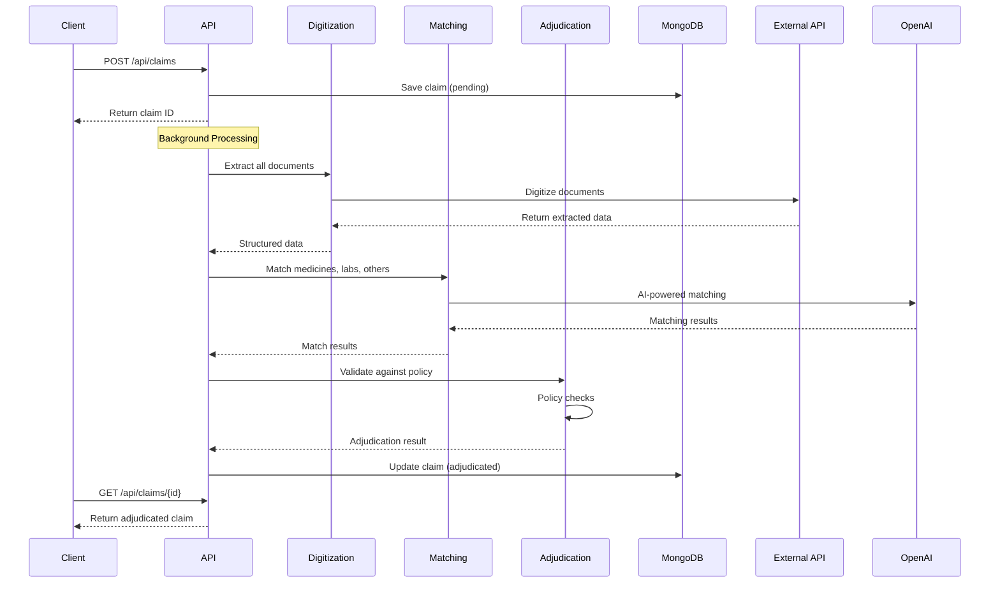

# ClearClaim - AI-Powered OPD Claim Adjudication System

An intelligent backend system that automates OPD (Out-Patient Department) claim processing using AI-powered document digitization, intelligent matching, and policy-based adjudication.

## 🎯 Problem Statement

Traditional health insurance claim processing is manual, time-consuming, and error-prone. Healthcare providers and patients often face delays in claim approvals due to:
- Manual document verification
- Complex policy rule interpretation
- Medicine/prescription matching challenges
- Lack of real-time status updates

## ✨ Solution

ClearClaim automates the entire claim adjudication process:
1. **Automatic Document Digitization** - Extracts structured data from prescriptions, invoices, and lab reports
2. **AI-Powered Matching** - Uses OpenAI to intelligently match invoice items with prescriptions
3. **Policy-Based Adjudication** - Validates claims against insurance policies with detailed reasoning
4. **Real-Time Status Tracking** - Provides live updates on claim processing status

## 🚀 Features

### Core Functionality
- ✅ **Claim Creation** - Submit OPD claims with prescription, invoice, and lab report documents
- ✅ **Background Processing** - Automatic digitization, matching, and adjudication
- ✅ **Intelligent Matching** - AI-powered matching for:
  - Medicines (with OCR error handling)
  - Lab tests (with panel-to-component matching)
  - Other services (with financial item auto-approval)
- ✅ **Policy Validation** - Comprehensive checks against insurance policies:
  - Policy active status
  - Date validations
  - Benefit coverage
  - Exclusions checking
- ✅ **Detailed Rejection Reasons** - Specific messages explaining why items don't qualify

### Supported Policies
- **Niva Bupa** - Full policy coverage validation
- **Aditya Birla Health Insurance** - Full policy coverage validation

## 🛠️ Tech Stack

- **Runtime**: Node.js with TypeScript
- **Framework**: Express.js
- **Database**: MongoDB (local)
- **AI/ML**: OpenAI GPT-4o-mini for intelligent matching
- **Document Processing**: External digitization API
- **Package Manager**: Yarn

## 📋 Prerequisites

- Node.js (v18 or higher)
- MongoDB (running locally on port 27017)
- Yarn package manager
- OpenAI API key
- Digitization API credentials

## 🔧 Installation & Setup

### 1. Clone the Repository
```bash
git clone <repository-url>
cd clearclaim-be
```

### 2. Install Dependencies
```bash
yarn install
```

### 3. Environment Configuration

Create a `.env` file in the root directory:

```env
PORT=8000
MONGODB_URI=mongodb://localhost:27017/clearclaim
DIGITIZATION_API_URL=https://zyvelor-document-extractor-uat.ambitiousstone-b2402989.centralindia.azurecontainerapps.io/api/extract
DIGITIZATION_API_KEY=your_digitization_api_key
OPENAI_API_KEY=your_openai_api_key
GEMINI_API_KEY=your_gemini_api_key
NODE_ENV=development
```

### 4. Start MongoDB
```bash
# Make sure MongoDB is running locally
mongod
```

### 5. Run the Application

**Development mode:**
```bash
yarn dev
```

**Production mode:**
```bash
yarn build
yarn start
```

The server will start on `http://localhost:8000`

## 📡 API Endpoints

### Health Check
```bash
GET /health
```

### Create a Claim
```bash
POST /api/claims
Content-Type: application/json

{
  "patientDetails": {
    "name": "John Doe"
  },
  "prescriptionsUrls": [
    { "url": "https://example.com/prescription.pdf" }
  ],
  "invoiceUrls": [
    { "url": "https://example.com/invoice.pdf" }
  ],
  "supportDocumentsUrl": [
    { "url": "https://example.com/lab-report.pdf" }
  ],
  "userRaisedAmount": "1500.00",
  "requestDate": "20/12/2025",
  "policyDocuments": [
    { "policyName": "Niva Bupa" }
  ]
}
```

### Get All Claims
```bash
GET /api/claims?page=1&limit=10
```

### Get Claim by ID
```bash
GET /api/claims/{claimId}
```

### Submit Adjudicated Claim
```bash
POST /api/claims/{claimId}/submit
```

## 🔄 Claim Processing Flow



## 🏗️ Architecture

```
src/
├── models/           # MongoDB schemas
├── controllers/      # HTTP request handlers
├── services/         # Business logic
│   ├── claimService.ts
│   ├── digitizationService.ts
│   ├── matchingService.ts
│   └── adjudicationService.ts
├── routers/          # Express routes
├── utils/            # Utilities (OpenAI, digitization client)
├── prompts/          # AI prompts for matching
├── data/             # Hardcoded policy data
│   └── policies/
├── constants/        # Extraction field definitions
├── config/           # Configuration (env, database)
└── types/            # TypeScript interfaces
```

## 🧠 AI-Powered Features

### Intelligent Matching
- **Medicine Matching**: Handles OCR errors, brand/generic name variations, therapeutic equivalents
- **Lab Test Matching**: Panel-to-component matching, abbreviation recognition, related test detection
- **Service Matching**: Financial item auto-approval, prescription justification

### Policy Validation
- Automatic policy rule interpretation
- Detailed rejection reasons with specific explanations
- Coverage limit validation
- Exclusion checking

## 📊 Claim Status Flow

1. **pending** - Claim created, waiting for processing
2. **digitizing** - Documents being digitized
3. **adjudicating** - Matching and policy validation in progress
4. **adjudicated** - Processing complete, ready for submission
5. **submitted** - Claim submitted by doctor

## 🔍 Example Response

```json
{
  "success": true,
  "data": {
    "_id": "65a1b2c3d4e5f6a7b8c9d0e1",
    "status": "adjudicated",
    "adjudicationResult": {
      "approved": true,
      "rejectionReasons": [],
      "notes": "Adjudication completed successfully - all checks passed",
      "matchingResults": {
        "medicines": [...],
        "labTests": [...],
        "others": [...]
      },
      "policyValidation": {
        "isActive": true,
        "isDateValid": true,
        "benefitCoverage": true,
        "coverageLimits": true
      }
    }
  }
}
```

## 🧪 Testing

See `API_TESTING.md` for complete cURL commands and testing examples.

Quick test:
```bash
# Health check
curl http://localhost:8000/health

# Create claim
curl -X POST http://localhost:8000/api/claims \
  -H "Content-Type: application/json" \
  -d @example-claim.json
```

## 🚧 Future Enhancements

- [ ] Support for more insurance policies
- [ ] Real-time webhook notifications
- [ ] Advanced fraud detection
- [ ] Claim history and analytics
- [ ] Multi-tenant support
- [ ] Queue-based processing for scalability
- [ ] Integration with insurance provider APIs

## 📝 Notes

- This is a hackathon prototype - optimized for demonstration


---

